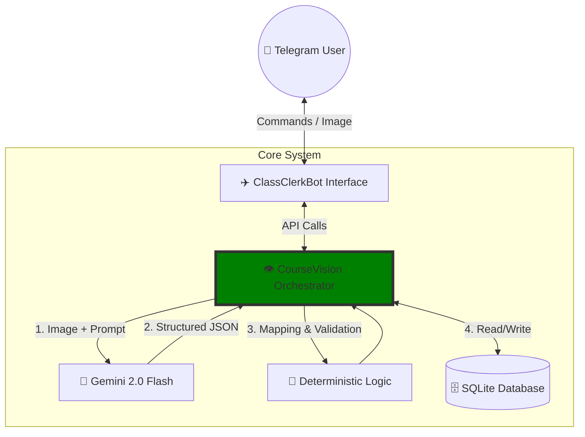

[English](#english) | [Português](#português-brasil)

# 👁️‍🗨️CourseVision (ClassClerkBot)

<p align="center">
  
</p>

> **Transform your static college schedule into a dynamic AI-managed calendar via Telegram.**

[](https://www.python.org/downloads/)
[](https://aistudio.google.com/)
[](https://www.docker.com/)
[](https://www.telegram.org/)


## ✨ Key Features

*   **📸 Intelligent OCR:** Snap a photo of your printed or digital schedule. Gemini extracts Subjects, Codes, Professors, and Classrooms with high precision.
*   **🗓️ Deterministic Scheduling:** Automatically maps extracted classes to the current week (Monday-Friday) using a smart 2-per-day logic.
*   **🔄 Auto-Sync:** Uploading a new schedule automatically wipes the old one for that week—no manual cleanup required.
*   **🔒 Granular Privacy:** Restrict access to specific Telegram User IDs.
*   **🔔 Smart Reminders:** Set customizable notifications to alert you before your classes start.
*   **🤖 Model Resilience:** Automatic fallback logic ensures the bot stays online even if primary API quotas are hit.
*   **🌐 Multi-language:** Supports both English and Portuguese.

---

## 🛠️ Architecture & Tech
CourseVision acts as the intelligent backend for schedule processing and management. It interfaces seamlessly with **ClassClerkBot**, your dedicated ✈️ Telegram bot, providing an intuitive chat interface for all your scheduling needs.

-   **Core:** `Python 3.14` with `python-telegram-bot`
-   **Vision Engine:** `google-genai` (Gemini 2.0 Flash) utilizing **Structured Outputs**
-   **Data Layer:** `SQLite` + `Pydantic` for strict schema validation
-   **DevOps:** Fully containerized with `Docker` & `Docker Compose`

### CI/CD & Quality Gates
To ensure code quality and project stability, CourseVision employs a robust CI/CD pipeline and local quality gates:

*   **Tools:** Ruff (linting/formatting), pip-audit (dependency security), Bandit (static analysis security), Pytest (unit testing).
*   **Docker Integration:** All CI checks run within Docker containers, ensuring a consistent and isolated environment.
*   **GitHub Actions:** Automated workflow (`.github/workflows/ci.yml`) runs all checks on `push` and `pull_request` to `main`.
*   **Local Checks:** `docker compose` commands are provided for local execution of these checks without needing local Python installations.

## Orchestration
CourseVision acts as the central orchestrator, managing the lifecycle of your schedule from image capture to database persistence.

---

## 🚀 Quick Start

### 1. Prerequisites
1.  **API Keys:** Get a [Gemini API Key](https://aistudio.google.com/) and a [Telegram Token](https://t.me/botfather).
2.  **ID:** Find your ID via [@userinfobot](https://t.me/userinfobot).

### 2. Setup
```bash
# Clone the repository
git clone https://github.com/V-Castro-Alves/course-vision.git
cd CourseVision

# Create environment file
cp .env.example .env
# Edit .env with your credentials
```

### 3. Run
**Using Docker (Recommended):**
```bash
docker compose up --build -d
```
**Using Python:**
```bash
pip install -r requirements.txt
python main.py
```

---

## 📌 Usage Flow

1.  **/start** or **/help** to initialize and see available commands.
2.  **/setlang pt-br|en** to choose your preferred language.
3.  **/upload** to learn how to upload your schedule.
4.  **Attach Image** — Send the schedule photo directly! The bot will automatically detect it and ask if you want to process it.
5.  **/today** or **/schedule** to see your week at a glance.
6.  **/remind <minutes>** to set a reminder (e.g., `/remind 15`) or **/remind off** to disable it.

---

## 5. Final Polish Tips

*   **License:** This project is licensed under the MIT License - see the [LICENSE](LICENSE) file for details.
*   **Deterministic Logic Warning:** Note that several design and architectural decisions were made based on the specific structure needed by the author. For your personal use, it is recommended to adapt the logic to better fit the format of your needs.


---

## Português (Brasil)

### ✨ Funcionalidades Principais

*   **📸 OCR Inteligente:** Tire uma foto do seu horário impresso ou digital. O Gemini extrai Assuntos, Códigos, Professores e Salas de Aula com alta precisão.
*   **🗓️ Agendamento Determinístico:** Mapeia automaticamente as aulas extraídas para a semana atual (segunda a sexta-feira) usando uma lógica inteligente de 2 aulas por dia.
*   **🔄 Sincronização Automática:** Fazer upload de um novo horário apaga automaticamente o antigo para aquela semana — nenhuma limpeza manual é necessária.
*   **🔒 Privacidade Granular:** Restringe o acesso a IDs de Usuários específicos do Telegram.
*   **🔔 Lembretes Inteligentes:** Configure notificações personalizadas para alertá-lo antes do início de suas aulas.
*   **🤖 Resiliência do Modelo:** A lógica de fallback automático garante que o bot permaneça online mesmo se as cotas da API principal forem atingidas.
*   **🌐 Multi-idioma:** Suporta Inglês e Português.

---

## 🛠️ Arquitetura e Tecnologia
CourseVision atua como o backend inteligente para processamento e gerenciamento de dados de horário. Ele se integra perfeitamente com o **ClassClerkBot**, seu ✈️ bot dedicado do Telegram, fornecendo uma interface de chat intuitiva para todas as suas necessidades de agendamento.

-   **Core:** `Python 3.14` com `python-telegram-bot`
-   **Mecanismo de Visão:** `google-genai` (Gemini 2.0 Flash) utilizando **Saídas Estruturadas**
-   **Camada de Dados:** `SQLite` + `Pydantic` para validação rigorosa de esquema
-   **DevOps:** Totalmente conteinerizado com `Docker` e `Docker Compose`

---

## 🚀 Início Rápido

### 1. Pré-requisitos
1.  **Chaves de API:** Obtenha uma [Chave de API do Gemini](https://aistudio.google.com/) e um [Token do Telegram](https://t.me/botfather).
2.  **ID:** Encontre seu ID via [@userinfobot](https://t.me/userinfobot).

### 2. Configuração
```bash
# Clone o repositório
git clone https://github.com/V-Castro-Alves/course-vision.git
cd CourseVision

# Crie o arquivo de ambiente
cp .env.example .env
# Edite .env with suas credenciais
```

### 3. Execução
**Usando Docker (Recomendado):**
```bash
docker compose up --build -d
```
**Usando Python:**
```bash
pip install -r requirements.txt
python main.py
```

---

## 📌 Fluxo de Uso

1.  **/start** ou **/help** para inicializar e ver os comandos disponíveis.
2.  **/setlang pt-br|en** para escolher seu idioma preferido.
3.  **/upload** para aprender como enviar seu horário.
4.  **Anexar Imagem** — Envie a foto do horário diretamente! O bot irá detectá-la automaticamente e perguntará se deseja processar.
5.  **/today** or **/schedule** para ver sua semana rapidamente.
6.  **/remind <minutos>** para configurar um lembrete (ex: `/remind 15`) ou **/remind off** para desativá-lo.
